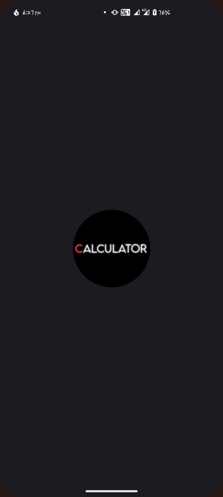
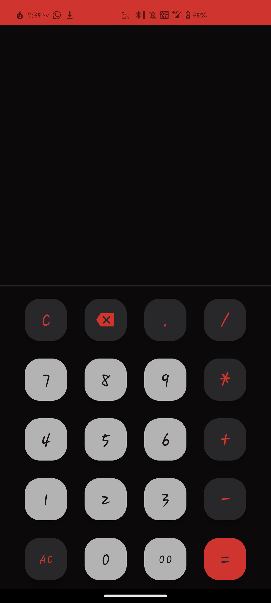
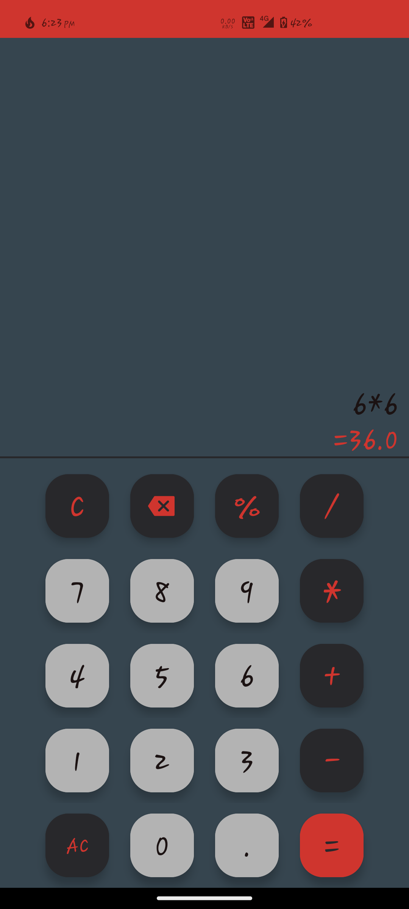

# *Calculator*


## Screenshots

**Laucher**



**Activity**



**Working**


## Developed Using

**IDE :** Android Studio

**Language :** Kotlin 


## To Run the Project

*Clone the project*

```bash
  git clone https://link-to-project
```

*Go to the project directory*

```bash
  cd Application-(Apk)
  install app-debug.apk
```

*or*

*Import the Project in Android Studio and Build*


## 🔗 Links & Support

[](https://www.linkedin.com/in/santhosh-swamy-v-22ab6b234)

[](https://instagram.com/sd._.sandy?igshid=MzRlODBiNWFlZA==)

[](https://wa.me/+918754120190)

